# Cat Connection

## Description

Cat Connection is a social network API for cat lovers!  Create an account, post thoughts about cats, and react to other users' cat thoughts! 

## Installation

1. Install [Node.js](https://nodejs.org/en).
2. Install [MongoDB](https://www.mongodb.com/docs/manual/installation/)
3. Clone or fork the [repo](https://github.com/scelsic2/cat-connect).
4. Open the repo with VS Code.
5. Open an integrated terminal in the repo folder.
6. In the terminal, run `npm init`.
7. In the terminal, run `npm install express`.
8. In the terminal, run `npm install mongodb`.
9. In the terminal, run `npm install mongoose @6^`.
10. In the terminal, run `npm install nodemon`.
11. Start the server with `npm run dev`.

## Usage
Add a user.
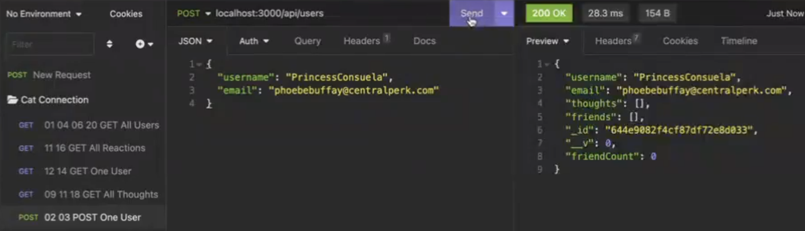

Edit a user.
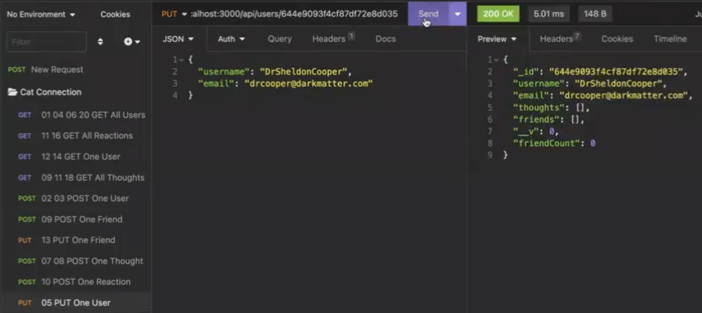

View all users.
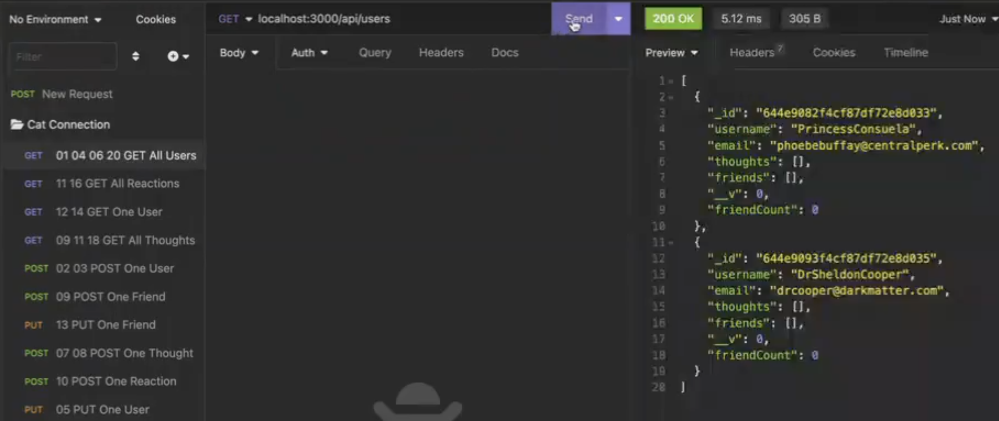

Add a thought.
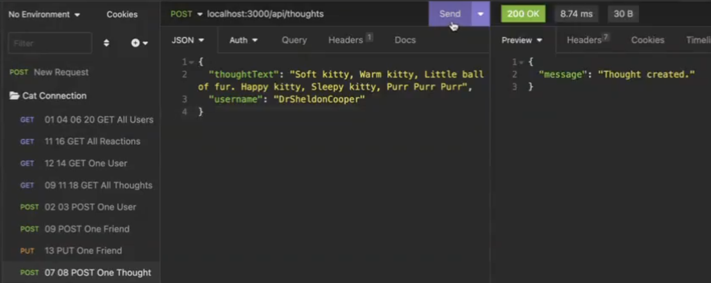

Edit a thought.
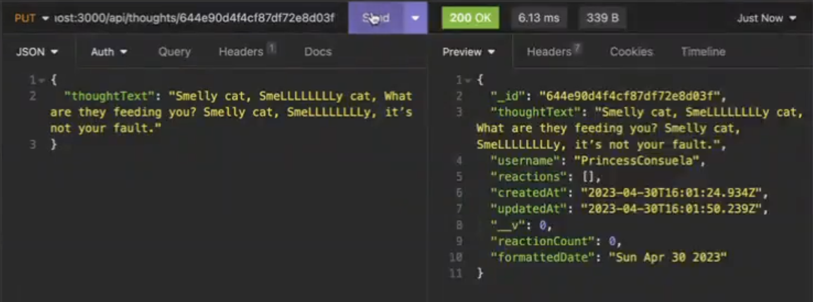

View all thoughts.
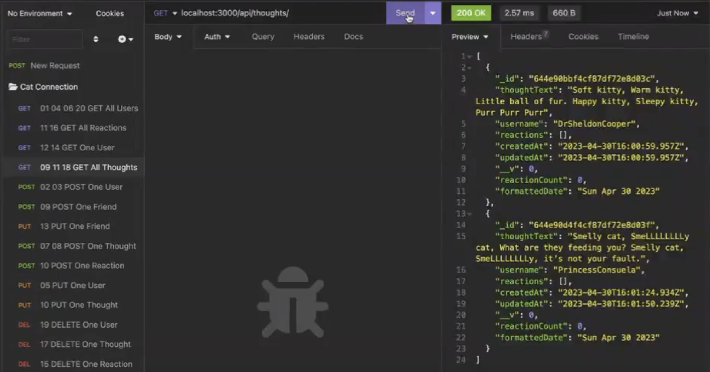

Add a friend to friend list.
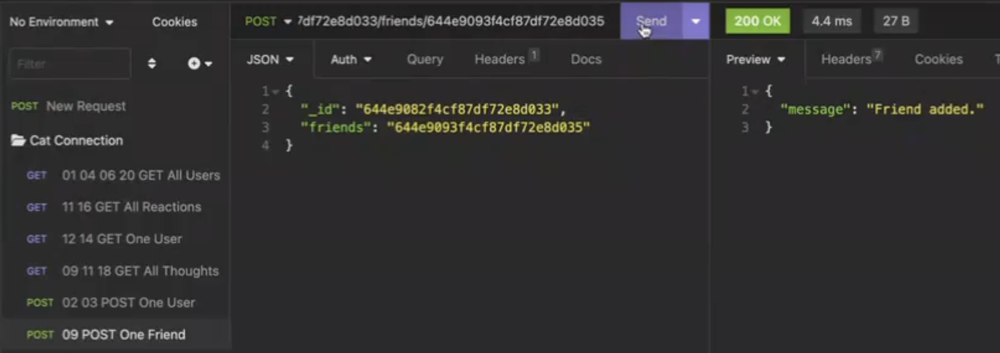

View a user with associated thoughts and friends.
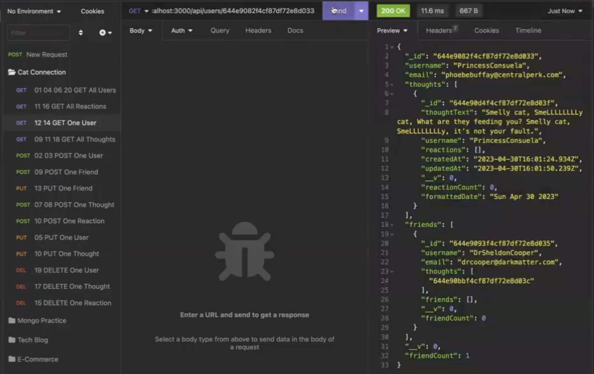

Remove a friend from a friend list.
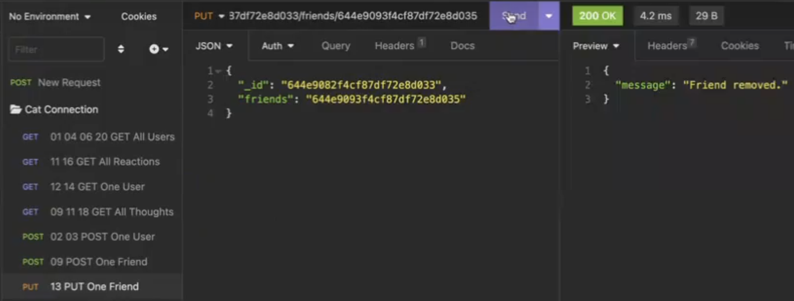

Create a reaction.
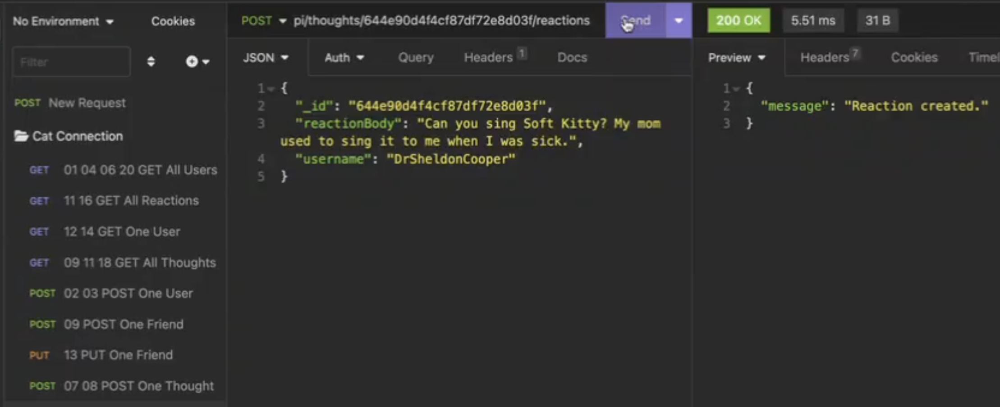

View all reactions.
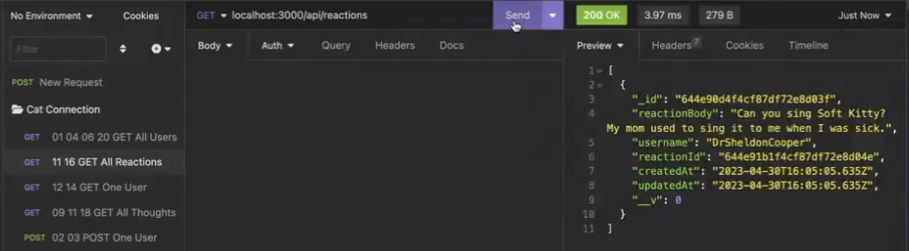

Delete a reaction.
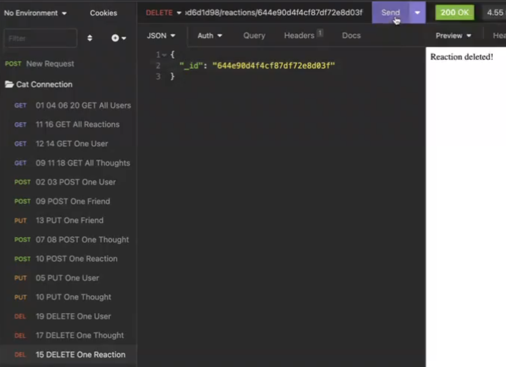

Delete a thought.
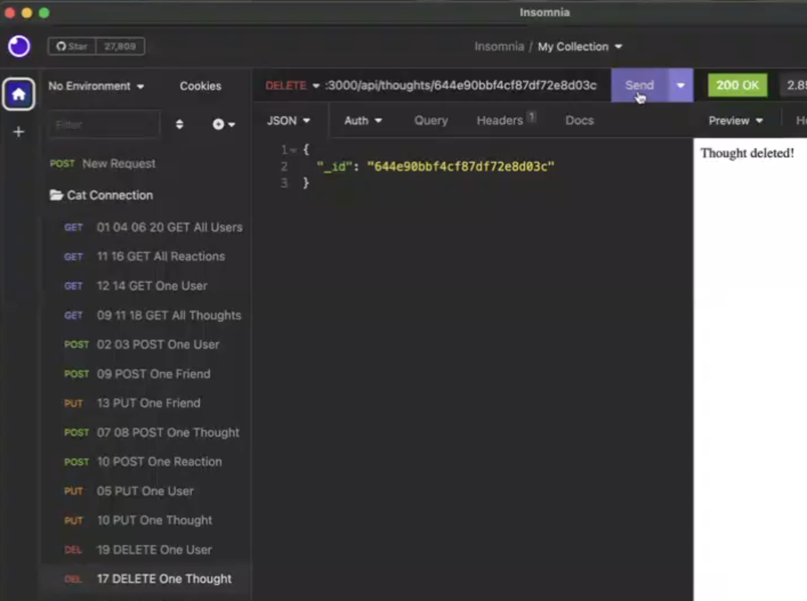

Delete a user.
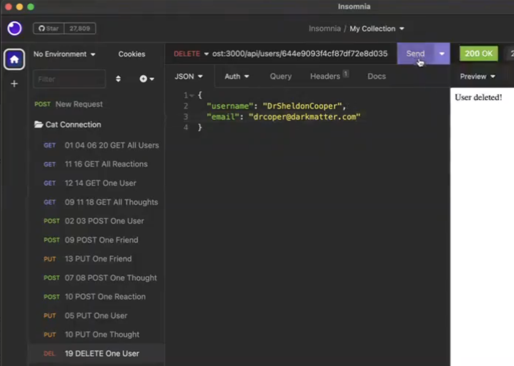

## Credits

- https://github.com/jdtdesigns/rut_mongoose_overview
- Office Hours 28APR2023
- https://www.freecodecamp.org/news/how-to-format-dates-in-javascript/
- https://www.mongodb.com/docs/manual/reference/operator/update/push/
- https://github.com/joce1ynn/social-network-NoSQL
- Module 18, Activity 21
- Tutoring 30APR2023
- https://www.mongodb.com/docs/manual/reference/operator/update/pull/
- https://www.youtube.com/watch?v=DZBGEVgL2eE
- https://www.youtube.com/results?search_query=mongoose+pull
 
## License

MIT License

## Walkthrough

